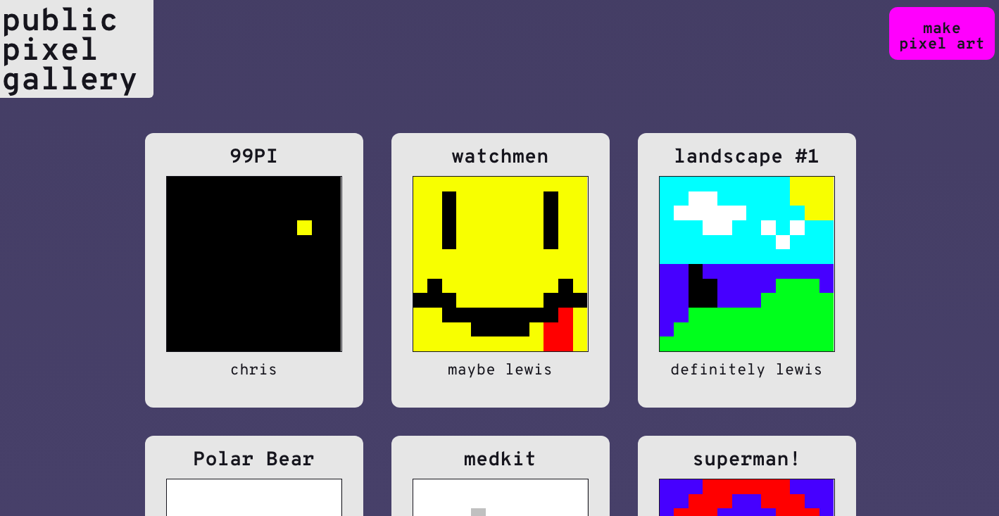

# The Public Pixel Gallery

#### [Public Pixel Gallery on GitHub pages] (https://lewisbrignell.github.io/projectFivePublicPixelGallery/)

## What's it made with?

This project is built in React, styled using CSS3. Data is stored in and called from Firebase.

## What is it?

Like the name says, this is a gallery of pixel art that anyone can view AND create.

## How does it work?

Just click on the 'make art' button in the top right corner to make something yourself, you get a 12 x 12 grid and 10 colours. Please be sure to include a title and name before submitting. You can cancel your art at any time.